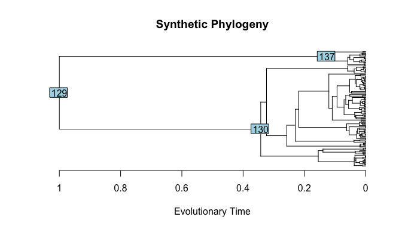

<!-- README.md is generated from README.Rmd. Please edit that file -->

# vbar

<!-- badges: start -->
<!-- badges: end -->

The goal of `vbar` is to implement Variational Bayes Ancestral
Reconstruction for collections of discrete and continuous phenotypic
traits given a phylogeny of evolutionary relationships between species.
Discrete traits may be ordinal or nominal, while continuous traits may
be scalar- or function-valued. Ancestral Reconstruction is based on the
Phylogenetic Latent Variable Model (PLVM) for trait evolution. This
model accommodates repeated measurements for extant species.

## Installation

You can install the development version from
[GitHub](https://github.com/) with:

``` r
# install.packages("devtools")
devtools::install_github("jpmeagher/vbar")
```

## Synthetic Example

Consider a synthetic example. Its analysis requires the following
packages.

``` r
library(vbar)
library(ape)
library(ggplot2)
```

We will reconstruct

manifest traits for the common ancestors of

extant taxa, given

recordings of these traits for each extant species

such that we have recordings for

individuals in total. These traits will consist of one ordinal, one
nominal, one scalar-valued, and one function-valued trait. Our first
task is to simulate these traits from the PLVM generative model.

### Phylogenetic Tree

The shared evolutionary history between taxa is modeled as a known,
fixed phylogeny
.

is a bifurcating, directed, acyclic graph tree with nodes

linked by branches
.
The graph originates at the degree-2 root node

and terminates at the degree-1 terminal nodes

corresponding to the extant taxa. Node
 is linked to its
parent
}")
by the branch of length
 for all
.
For notational convenience, we let

denote a continuous position along a branch of
,
where

corresponds to node
 for all
.
Furthermore, we define the patristic distance operator
"),
which is the the shortest path from

to

over
.

``` r
S <- 2^7
set.seed(98)
phy <- rcoal(S)
phy <- scale_phylo(phy, max_dist = 1)
#> Loading required namespace: testthat
```



### Phylogenetic Latent Variables

Given
,
we assume that the evolution of manifest traits is driven by

latent traits, modelled as independent Ornstein-Uhlenbeck (OU) processes
on
.
These are the phylogenetic latent variables. For
,
we have

 &\sim \mathcal{GP} \left( 0, k_l \left( \boldsymbol t, \boldsymbol t' \right)\right), \\
k_l \left( \boldsymbol t, \boldsymbol t' \right) &=  h_l^2 \exp \left( - \frac{d_{\mathcal T} \left( \boldsymbol t, \boldsymbol t' \right) }{\ell} \right) + \left( 1 - h_l^2\right) \delta \left( \boldsymbol t \in \left\{ \boldsymbol t_1, \dots, \boldsymbol t_S\right\}\right)
\end{aligned}
")

for
,
where
")
is the heritability of the

latent trait,

is the fixed phylogenetic length-scale, and
")
is the indicator function.

The OU process is a Gauss-Markov process, a property we will exploit to
develop a computationally efficient inference scheme. If we denote
"),
then

\\
f_{s,l} \mid f_{\operatorname{pa} \left( s \right),l}, h &\sim \mathcal N \left( \nu_{s, l} f_{\operatorname{pa} \left( s \right),l}, \eta_{s, l}^2 \right)
\end{aligned}
")

where, given
")
and
")

![
\\begin{aligned}
\\nu\_{s, l} &= k\_{s, \\operatorname{pa} \\left( s \\right),l} k\_{\\operatorname{pa} \\left( s \\right), l}^{-1}, \\\\
&= \\exp\\left( -\\frac{d\_{\\mathcal T} \\left( \\boldsymbol t\_s, \\boldsymbol t\_{\\operatorname{pa} \\left( s \\right)} \\right) }{\\ell}\\right), \\\\
\\eta\_{s, l}^2 &= k\_{s, l} - \\nu\_{s, l} \\, k\_{\\operatorname{pa} \\left( s \\right), s, l}, \\\\
&= \\frac{\\ell h\_l^2}{2} \\left( 1 - \\exp \\left( - 2 \\frac{d\_{\\mathcal T} \\left( \\boldsymbol t\_s, \\boldsymbol t\_{\\operatorname{pa} \\left( s \\right)} \\right) }{\\ell} \\right) \\right) + \\left( 1 - h\_l^2\\right) \\delta \\left( \\boldsymbol t \\in \\left\\{ \\boldsymbol t\_1, \\dots, \\boldsymbol t\_S\\right\\}\\right).
\\end{aligned}
](https://latex.codecogs.com/png.latex?%0A%5Cbegin%7Baligned%7D%0A%5Cnu_%7Bs%2C%20l%7D%20%26%3D%20k_%7Bs%2C%20%5Coperatorname%7Bpa%7D%20%5Cleft%28%20s%20%5Cright%29%2Cl%7D%20k_%7B%5Coperatorname%7Bpa%7D%20%5Cleft%28%20s%20%5Cright%29%2C%20l%7D%5E%7B-1%7D%2C%20%5C%5C%0A%26%3D%20%5Cexp%5Cleft%28%20-%5Cfrac%7Bd_%7B%5Cmathcal%20T%7D%20%5Cleft%28%20%5Cboldsymbol%20t_s%2C%20%5Cboldsymbol%20t_%7B%5Coperatorname%7Bpa%7D%20%5Cleft%28%20s%20%5Cright%29%7D%20%5Cright%29%20%7D%7B%5Cell%7D%5Cright%29%2C%20%5C%5C%0A%5Ceta_%7Bs%2C%20l%7D%5E2%20%26%3D%20k_%7Bs%2C%20l%7D%20-%20%5Cnu_%7Bs%2C%20l%7D%20%5C%2C%20k_%7B%5Coperatorname%7Bpa%7D%20%5Cleft%28%20s%20%5Cright%29%2C%20s%2C%20l%7D%2C%20%5C%5C%0A%26%3D%20%5Cfrac%7B%5Cell%20h_l%5E2%7D%7B2%7D%20%5Cleft%28%201%20-%20%5Cexp%20%5Cleft%28%20-%202%20%5Cfrac%7Bd_%7B%5Cmathcal%20T%7D%20%5Cleft%28%20%5Cboldsymbol%20t_s%2C%20%5Cboldsymbol%20t_%7B%5Coperatorname%7Bpa%7D%20%5Cleft%28%20s%20%5Cright%29%7D%20%5Cright%29%20%7D%7B%5Cell%7D%20%5Cright%29%20%5Cright%29%20%2B%20%5Cleft%28%201%20-%20h_l%5E2%5Cright%29%20%5Cdelta%20%5Cleft%28%20%5Cboldsymbol%20t%20%5Cin%20%5Cleft%5C%7B%20%5Cboldsymbol%20t_1%2C%20%5Cdots%2C%20%5Cboldsymbol%20t_S%5Cright%5C%7D%5Cright%29.%0A%5Cend%7Baligned%7D%0A "
\begin{aligned}
\nu_{s, l} &= k_{s, \operatorname{pa} \left( s \right),l} k_{\operatorname{pa} \left( s \right), l}^{-1}, \\
&= \exp\left( -\frac{d_{\mathcal T} \left( \boldsymbol t_s, \boldsymbol t_{\operatorname{pa} \left( s \right)} \right) }{\ell}\right), \\
\eta_{s, l}^2 &= k_{s, l} - \nu_{s, l} \, k_{\operatorname{pa} \left( s \right), s, l}, \\
&= \frac{\ell h_l^2}{2} \left( 1 - \exp \left( - 2 \frac{d_{\mathcal T} \left( \boldsymbol t_s, \boldsymbol t_{\operatorname{pa} \left( s \right)} \right) }{\ell} \right) \right) + \left( 1 - h_l^2\right) \delta \left( \boldsymbol t \in \left\{ \boldsymbol t_1, \dots, \boldsymbol t_S\right\}\right).
\end{aligned}
")

for

and
} \right) = b_s").

In this example, we let
^\top = \left( \sqrt{0.95}, \sqrt{0.66}, \sqrt{0.25} \right)^\top"),
such that the heritability of latent traits ranges from high to low.

``` r
h <- sqrt(c(0.95, 0.66, 0.25))
latent_taxa_traits <- sapply(
  h, function(x) {
    simulate_phylogenetic_ou(
      phy = phy, 
      heritable_amplitude = x, length_scale = 2,
      environmental_amplitude = sqrt(1 - x^2),
      internal = TRUE
    )
  }
)
```
