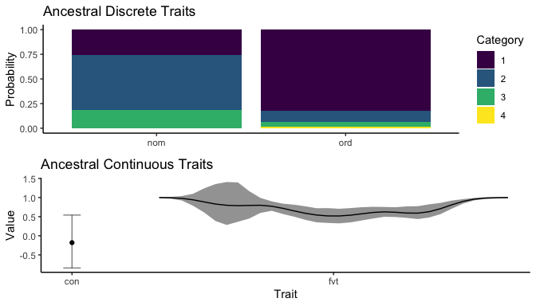
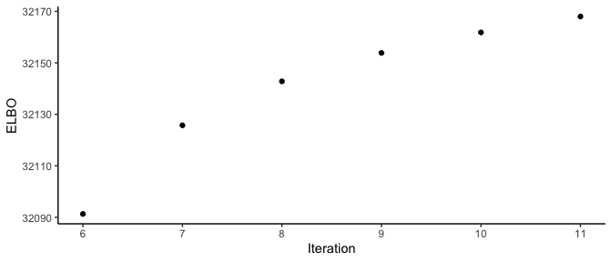
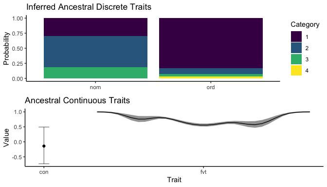

<!-- README.md is generated from README.Rmd. Please edit that file -->

# vbar

<!-- badges: start -->
<!-- badges: end -->

The goal of `vbar` is to implement Variational Bayes Ancestral
Reconstruction for collections of discrete and continuous phenotypic
traits given a phylogeny of evolutionary relationships between species.
Discrete traits may be ordinal or nominal, while continuous traits may
be scalar- or function-valued. Ancestral Reconstruction is based on the
Phylogenetic Latent Variable Model (PLVM) for trait evolution. This
model accommodates repeated measurements for extant species.

This readme is laid out as follows: after presenting code installing the
`vbar` package, the Generalised Phylogenetic Latent Variable Model
(PLVM) for trait evolution is outlined. In order to illustrate more
clearly the assumptions underpinning this model, a synthetic data set is
generated from the PLVM. Approximate Bayesian Inference for this
synthetic data set, which is included with the package, demonstrates how
the `vbar` package is applied for Ancestral Reconstruction.

## Installation

You can install the development version from
[GitHub](https://github.com/) with:

``` r
# install.packages("devtools")
devtools::install_github("jpmeagher/vbar")
```

## The Generalised Phylogenetic Latent Variable Model

Consider the
-dimensional
observation of

discrete- or continuous-valued manifest traits
^\top"),
specific to individual

within taxon
,
where traits may be ordinal-, nominal-, scalar- or function-valued.

The shared evolutionary history between taxa is modeled as a known,
fixed phylogeny
.

is a bifurcating, directed, acyclic graph tree with nodes

linked by branches
.
The graph originates at the degree-2 root node

and terminates at the degree-1 terminal nodes

corresponding to the extant taxa. Node

is linked to its parent
}")
by the branch of length

for all
.
For notational convenience, we let

denote a continuous position along a branch of
,
where

denotes the position of node

for all
.
Furthermore, the patristic distance operator
")
defines the shortest path from

to

over
.

For each manifest trait, we introduce auxiliary traits
^\top \in \mathbb R^{D'}")
such that
,
there exists a deterministic map
,
and auxiliary traits mapping

are indexed by
.
This allows us to adopt a probit model for discrete traits.

If

for

is a nominal trait belonging to one of

**unordered** categories, we have a
-to-1
mapping such that

 = c_{k}, \text{ if } x_{s, n, d' + k - 1} = \max \left\{ x_{s, n, d'} , \dots, x_{s, n, d' + K - 1} \right\}.")

If

for

is an ordinal trait belonging to one of

**ordered** categories, we have a 1-to-1 mapping

 = k, \text{if } \gamma_{k-1} \leq  x_{snd} <  \gamma_{k},")

given thresholds
^\top")
where
,
,
,
and
.
Finally, if

takes continuous values, then any bijective map to the real numbers is
appropriate. We then assume that

,")

where
^\top \in \mathbb R^{D'}")
is the expected auxiliary trait and

is a diagonal precision matrix parameterised by
 \in \mathbb R_+^{P}").
Note that we consider one independent precision parameter for each of
the

manifest traits, where

when

maps to the

manifest trait and

is fixed when that trait is discrete.

In order to define the PLVM, let


where

is the loading matrix with columns denoted

for
,
rows

for
,
and
^\top \in \mathbb R^{L}")
is the individual-specific latent trait. We link

to the taxon-specific latent trait
^\top \in \mathbb R^{L}")
by setting


where
")
is the standard deviation of the inter-taxon variation driven by
")
and we have
^\top").
Taxon-specific latent traits are modelled as independent phylogenetic
Ornstein-Uhlenbeck (OP) processes over

such that

, \\
f_l \left( \boldsymbol t \right) &\sim \mathcal{GP} \left( 0, k_l \left( \boldsymbol t, \boldsymbol t'  \right) \right), \\
k_l \left( \boldsymbol t, \boldsymbol t' \right) &=  h_l^2 \exp \left( - \frac{d_{\mathcal T} \left( \boldsymbol t, \boldsymbol t' \right) }{\ell} \right) + \left( 1 - h_l^2\right) \delta_{\boldsymbol t} \, \delta_{\boldsymbol t'}
\end{aligned}")

where
")
is the heritability of the

latent trait such that
^\top"),

is the fixed phylogenetic length-scale, and


identifies extant taxa. Restricting

and

in this manner avoids scale invariance in the Gaussian likelihood, but
still provides a flexible model for latent trait evolution, similar to
the Phylogenetic Mixed Model for trait evolution.

The OU process is a Gauss-Markov process. As such, it can be shown that

\\
f_{sl} \mid f_{\operatorname{pa} \left( s \right),l} &\sim \mathcal N \left( \nu_{s, l} f_{\operatorname{pa} \left( s \right),l}, \eta_{s, l}^2 \right)
\end{aligned}")

where, setting
")
and
"),

![\begin{aligned}
\nu\_{sl} &= k\_{s, \operatorname{pa} \left( s \right),l} k\_{\operatorname{pa} \left( s \right), l}^{-1}, \\\\
&= \exp\left( -\frac{d\_{\mathcal T} \left( \boldsymbol t_s, \boldsymbol t\_{\operatorname{pa} \left( s \right)} \right) }{\ell}\right), \\\\
\eta\_{sl}^2 &= k\_{s, l} - \nu\_{s, l} \\, k\_{\operatorname{pa} \left( s \right), s, l}, \\\\
&= h_l^2 \left( 1 - \exp \left( - 2 \frac{d\_{\mathcal T} \left( \boldsymbol t_s, \boldsymbol t\_{\operatorname{pa} \left( s \right)} \right) }{\ell} \right) \right) + \left( 1 - h_l^2\right) \delta\_{\boldsymbol t_s}
\end{aligned}](https://latex.codecogs.com/png.image?%5Cdpi%7B110%7D&space;%5Cbg_white&space;%5Cbegin%7Baligned%7D%0A%5Cnu_%7Bsl%7D%20%26%3D%20k_%7Bs%2C%20%5Coperatorname%7Bpa%7D%20%5Cleft%28%20s%20%5Cright%29%2Cl%7D%20k_%7B%5Coperatorname%7Bpa%7D%20%5Cleft%28%20s%20%5Cright%29%2C%20l%7D%5E%7B-1%7D%2C%20%5C%5C%0A%26%3D%20%5Cexp%5Cleft%28%20-%5Cfrac%7Bd_%7B%5Cmathcal%20T%7D%20%5Cleft%28%20%5Cboldsymbol%20t_s%2C%20%5Cboldsymbol%20t_%7B%5Coperatorname%7Bpa%7D%20%5Cleft%28%20s%20%5Cright%29%7D%20%5Cright%29%20%7D%7B%5Cell%7D%5Cright%29%2C%20%5C%5C%0A%5Ceta_%7Bsl%7D%5E2%20%26%3D%20k_%7Bs%2C%20l%7D%20-%20%5Cnu_%7Bs%2C%20l%7D%20%5C%2C%20k_%7B%5Coperatorname%7Bpa%7D%20%5Cleft%28%20s%20%5Cright%29%2C%20s%2C%20l%7D%2C%20%5C%5C%0A%26%3D%20h_l%5E2%20%5Cleft%28%201%20-%20%5Cexp%20%5Cleft%28%20-%202%20%5Cfrac%7Bd_%7B%5Cmathcal%20T%7D%20%5Cleft%28%20%5Cboldsymbol%20t_s%2C%20%5Cboldsymbol%20t_%7B%5Coperatorname%7Bpa%7D%20%5Cleft%28%20s%20%5Cright%29%7D%20%5Cright%29%20%7D%7B%5Cell%7D%20%5Cright%29%20%5Cright%29%20%2B%20%5Cleft%28%201%20-%20h_l%5E2%5Cright%29%20%5Cdelta_%7B%5Cboldsymbol%20t_s%7D%0A%5Cend%7Baligned%7D "\begin{aligned}
\nu_{sl} &= k_{s, \operatorname{pa} \left( s \right),l} k_{\operatorname{pa} \left( s \right), l}^{-1}, \\
&= \exp\left( -\frac{d_{\mathcal T} \left( \boldsymbol t_s, \boldsymbol t_{\operatorname{pa} \left( s \right)} \right) }{\ell}\right), \\
\eta_{sl}^2 &= k_{s, l} - \nu_{s, l} \, k_{\operatorname{pa} \left( s \right), s, l}, \\
&= h_l^2 \left( 1 - \exp \left( - 2 \frac{d_{\mathcal T} \left( \boldsymbol t_s, \boldsymbol t_{\operatorname{pa} \left( s \right)} \right) }{\ell} \right) \right) + \left( 1 - h_l^2\right) \delta_{\boldsymbol t_s}
\end{aligned}")

for
.
We also define
^\top")
and
^\top")
at this point.

The PLVM admits conjugate priors for the loading

and free auxiliary trait precision parameters

when we have

, \\
\lambda_p &\sim
\begin{cases}
\delta \left( 1 \right), & \text{if } p \text{ is a discrete trait}, \\
\operatorname{Gamma} \left( a_\lambda, b_\lambda \right), &\text{otherwise},
\end{cases}
\end{aligned}")

where

is the Automatic Relevance Determination (ARD) precision hyperparameter
such that
^\top"),

is a fixed covariance matrix enforcing smoothness constraints on
,
and

and

are shape and rate hyperparameters for precision associated with trait

taking values along a continuum, and we let
")
denote the one-point distribution with all its mass at
.

The PLVM also provides a direct approach to approach to ancestral
reconstruction. Firstly, note that this model for trait evolution allows
for within-taxon variation on the latent traits, governed by
.
Stripping away this stochastic effect on trait evolution allows us
define taxon-specific manifest and auxiliary traits,

and
,
such that

^{1/2} \boldsymbol f_s, \Lambda^{-1} \right)")

for
,

as before, and

is the diagonal covariance matrix parametrised by
^\top").

## Sampling from the Generative Model

Before outlining our approach inference for the PLVM, we sample from the
model. This provides the synthetic data set we use to validate the
inference scheme. We require the following packages.

``` r
library(vbar)
library(ape)
library(ggplot2)
library(magrittr)
library(reshape2)
library(dplyr)
library(mvnfast)
library(HDInterval)
library(ggpubr)
```

Our analysis considers

extant taxa with a shared evolutionary history defined by the phylogeny
below. We label the root node and its children for future reference.
Note that the `ape` package labels the root node

by default.

``` r
S <- 2^7
set.seed(98)
phy <- rcoal(S) %>% 
  scale_phylo(max_dist = 1)
```


traits are recorded for

individuals in the extant taxon
.
These traits consist of an ordinal trait with

ordered categories, a nominal trait with

unordered categories, a scalar-valued continuous trait, and a strictly
positive function-valued trait registered to 32 equidistant points along
the unit interval. Thus,

and

are

and

dimensional vectors respectively.

``` r
P <- 4
N_s <- rep(3, S)
N <- sum(N_s)
K_ord <- 4
K_nom <- 3
```

Auxiliary traits are generated by a PLVM with

latent traits, parameterised by

and
^\top")
such that auxiliary traits associated with discrete traits have
precision 1, the scalar-valued continuous trait has precision 10, and
the function-valued trait has precision of 10000. The loading matrix

is presented below.

``` r
auxiliary_trait_precision <- c(1, 1, 10, 10000)
L <- 3 
# FVT Loading
D_fvt <- 2^5 
x_fvt <- seq(0, 1, length.out = D_fvt) 
loading_fvt_means <- c(.2, .5, .75)
loading_fvt_sds <- c(.06, .12, .07)
loading_fvt <- sapply(
  seq_along(loading_fvt_means), 
  function(i) dnorm(x_fvt, mean = loading_fvt_means[i], sd = loading_fvt_sds[i])
  )
loading_fvt <- loading_fvt %*% diag(1 / c(5, 4, 6))
# Continuous Trait Loading
loading_con <- c(0.5, 0.25, -0.25)
# Nominal Trait loading
loading_nom <- matrix(c(1, 0, 0, 0, -0.5, 0, 0, 0, 1), byrow = TRUE, nrow = K_nom, ncol = L)
# Ordinal Trait Loading
loading_ord <- c(0, 1, 0.5)
# Full Loading
loading <- rbind(loading_ord, loading_nom, loading_con, loading_fvt)
rownames(loading) <- c(
  "ord", 
  paste("nom", 1:K_nom, sep = "."),
  "con", 
  paste("fvt", 1:D_fvt, sep = ".")
)
colnames(loading) <- paste("loading", 1:L, sep = ".")
```


The distribution of taxon- and individual-specific latent traits is
defined by the phylogenetic hyperparameters
^\top")
and
^\top")
and so we sample
.

``` r
tau <- sqrt(c(0.001, 0.05, 0.1))
h <- sqrt(c(0.95, 0.66, 0.25))

set.seed(99)
taxon_specific_latent_traits <- sapply(
  h, function(x) {
    simulate_phylogenetic_ou(
      phy = phy, 
      heritable_amplitude = x, length_scale = 2,
      environmental_amplitude = sqrt(1 - x^2),
      internal = TRUE
    )
  }
)

taxon_id <- sapply(1:S, function(i) rep(phy$tip.label[i], N_s[i])) %>% 
  c()

individual_specific_latent_traits <- sapply(
  1:L, function(l){
    sqrt(1 - tau[l]^2) * taxon_specific_latent_traits[taxon_id, l] + 
      tau[l] * rnorm(N)
  })
```

Given
,
,
and
,
we can define

and sample
.

``` r
D_prime <- nrow(loading)
auxiliary_traits_expectation <- individual_specific_latent_traits %*% t(loading)
auxiliary_trait_precision_vec <- c(
  auxiliary_trait_precision[1], 
  rep(auxiliary_trait_precision[2], K_nom), 
  auxiliary_trait_precision[3], 
  rep(auxiliary_trait_precision[4], D_fvt)
)

set.seed(100)
auxiliary_traits <- auxiliary_traits_expectation + 
  t(
    sapply(1:N, function(i){
      rnorm(D_prime, sd = sqrt(1 / auxiliary_trait_precision_vec))
      }
      )
    )
```

We map

to

by

given the ordinal trait cut-off points
^\top").
Furthermore, we set
 = \exp \left( x_{snd} \right) = y_{snd}")
when the index

corresponds to a function-valued trait.

``` r
cut_off_points <- c(-Inf, 0, 0.5, 1, Inf)

auxiliary_index_ord <- 1
auxiliary_index_nom <- max(auxiliary_index_ord) + (1:K_nom)
auxiliary_index_con <- max(auxiliary_index_nom) + 1
auxiliary_index_fvt <- max(auxiliary_index_con) + 1:D_fvt

manifest_traits <- data.frame(
  taxon_id = taxon_id,
  ord = sapply(auxiliary_traits[, auxiliary_index_ord], function(x){
    x > cut_off_points
  }) %>% 
    colSums() %>% 
    factor(ordered = TRUE),
  nom = apply(auxiliary_traits[, auxiliary_index_nom], 1, which.max) %>% 
    factor(ordered = FALSE),
  con = auxiliary_traits[, auxiliary_index_con],
  fvt = exp(unname(auxiliary_traits[, auxiliary_index_fvt]))
)
```


Given the mapping
,
loading
,
auxiliary trait precision parameters
,
individual-specific latent traits, and phylogenetic hyperparameters

and
,
we can explore the distribution of taxon-specific manifest traits

for any
.

``` r
covariance_ou <- ou_kernel(
  dist.nodes(phy),
  amplitude = 1, length_scale = 2
)
covariance_f <- lapply(h, function(x){
  tmp <- x^2 * covariance_ou
  tmp[1:S, 1:S] <- tmp[1:S, 1:S] + (1 - x^2)* diag(S)
  colnames(tmp) <- rownames(tmp) <- c(phy$tip.label, S + (1:(S-1)))
  tmp
})
covariance_zf <- lapply(1:L, function(i){
  tmp <- (1 - tau[i]^2) * covariance_f[[i]]
  tmp <- tmp[
    c(taxon_id, phy$tip.label, S + (1:(S-1))), 
    c(taxon_id, phy$tip.label, S + (1:(S-1)))
    ]
  tmp[1:N, 1:N] <- tmp[1:N, 1:N] + tau[i]^2 * diag(N)
  tmp
})

ancestral_mean <- sapply(1:L, function(i){
  (covariance_zf[[i]][-(1:N), (1:N)] %*% 
     chol2inv(chol(covariance_zf[[i]][(1:N), (1:N)])) %*% 
     individual_specific_latent_traits[, i])[, 1]
})
ancestral_cov <- lapply(1:L, function(i){
  covariance_zf[[i]][-(1:N), -(1:N)] - 
    covariance_zf[[i]][-(1:N), (1:N)] %*% 
    chol2inv(chol(covariance_zf[[i]][(1:N), (1:N)])) %*% 
    covariance_zf[[i]][(1:N), -(1:N)]
})
ancestral_sd <- sapply(ancestral_cov, function(X){
  sqrt(diag(X))
})
```

``` r
a <- "130" # ancestor
M <- 1000 # samples for ancestral reconstruction

scaled_taxon_latent_trait_ar <- rmvn(
  M, mu = ancestral_mean[a,], sigma = diag(ancestral_sd[a, ]), isChol = TRUE
  )
auxiliary_trait_ar <- scaled_taxon_latent_trait_ar %*% t(loading) + 
  t(
    sapply(1:M, function(i){
      rnorm(D_prime, sd = sqrt(1 / auxiliary_trait_precision_vec))
      }
      )
    )

manifest_trait_ar <- data.frame(
  ord = sapply(auxiliary_trait_ar[, auxiliary_index_ord], function(x){
    x > cut_off_points
  }) %>% 
    colSums() %>% 
    factor(ordered = TRUE),
  nom = apply(auxiliary_trait_ar[, auxiliary_index_nom], 1, which.max) %>% 
    factor(ordered = FALSE),
  con = auxiliary_trait_ar[, auxiliary_index_con],
  fvt = exp(unname(auxiliary_trait_ar[, auxiliary_index_fvt]))
)
```



## Approximate Bayesian Inference

Our objective is to infer a posterior distribution over
individual-specific auxiliary traits, the PLVM loading, individual- and
taxon-specific latent traits, and free auxiliary trait precision
parameters given manifest traits, a fixed phylogeny, and priors on the
model parameters. That is

![\begin{aligned}
p \left( \boldsymbol X, \boldsymbol W, \boldsymbol Z, \boldsymbol F \mid \boldsymbol Y, \mathcal T, \boldsymbol \psi \right) &\propto p \left(\boldsymbol Y \mid \boldsymbol X, \boldsymbol \gamma \right) p \left( \boldsymbol X \mid \boldsymbol W, \boldsymbol Z, \boldsymbol \lambda \right) p \left( \boldsymbol Z \mid \boldsymbol F, \boldsymbol \tau \right) p \left( \boldsymbol F \mid \boldsymbol h \right) p \left( \boldsymbol W \mid \boldsymbol \alpha \right) p \left( \boldsymbol \lambda \mid a\_\lambda, b\_\lambda \right),
\end{aligned}](https://latex.codecogs.com/png.image?%5Cdpi%7B110%7D&space;%5Cbg_white&space;%5Cbegin%7Baligned%7D%0Ap%20%5Cleft%28%20%5Cboldsymbol%20X%2C%20%5Cboldsymbol%20W%2C%20%5Cboldsymbol%20Z%2C%20%5Cboldsymbol%20F%20%5Cmid%20%5Cboldsymbol%20Y%2C%20%5Cmathcal%20T%2C%20%5Cboldsymbol%20%5Cpsi%20%5Cright%29%20%26%5Cpropto%20p%20%5Cleft%28%5Cboldsymbol%20Y%20%5Cmid%20%5Cboldsymbol%20X%2C%20%5Cboldsymbol%20%5Cgamma%20%5Cright%29%20p%20%5Cleft%28%20%5Cboldsymbol%20X%20%5Cmid%20%5Cboldsymbol%20W%2C%20%5Cboldsymbol%20Z%2C%20%5Cboldsymbol%20%5Clambda%20%5Cright%29%20p%20%5Cleft%28%20%5Cboldsymbol%20Z%20%5Cmid%20%5Cboldsymbol%20F%2C%20%5Cboldsymbol%20%5Ctau%20%5Cright%29%20p%20%5Cleft%28%20%5Cboldsymbol%20F%20%5Cmid%20%5Cboldsymbol%20h%20%5Cright%29%20p%20%5Cleft%28%20%5Cboldsymbol%20W%20%5Cmid%20%5Cboldsymbol%20%5Calpha%20%5Cright%29%20p%20%5Cleft%28%20%5Cboldsymbol%20%5Clambda%20%5Cmid%20a_%5Clambda%2C%20b_%5Clambda%20%5Cright%29%2C%0A%5Cend%7Baligned%7D "\begin{aligned}
p \left( \boldsymbol X, \boldsymbol W, \boldsymbol Z, \boldsymbol F \mid \boldsymbol Y, \mathcal T, \boldsymbol \psi \right) &\propto p \left(\boldsymbol Y \mid \boldsymbol X, \boldsymbol \gamma \right) p \left( \boldsymbol X \mid \boldsymbol W, \boldsymbol Z, \boldsymbol \lambda \right) p \left( \boldsymbol Z \mid \boldsymbol F, \boldsymbol \tau \right) p \left( \boldsymbol F \mid \boldsymbol h \right) p \left( \boldsymbol W \mid \boldsymbol \alpha \right) p \left( \boldsymbol \lambda \mid a_\lambda, b_\lambda \right),
\end{aligned}")

which can be expressed as

![\begin{aligned}
p \left( \boldsymbol X, \boldsymbol W, \boldsymbol Z, \boldsymbol F \mid \boldsymbol Y, \mathcal T, \boldsymbol \psi \right) 
&\propto \left( \prod\_{n = 1}^N p \left(\boldsymbol y_n \mid \boldsymbol x_n \right) p \left( \boldsymbol x_n \mid \boldsymbol W, \boldsymbol z_n, \boldsymbol \lambda \right) \right) 
\left( \prod\_{s = 1}^S \prod\_{n = 1}^{N_s} p \left( \boldsymbol z\_{sn} \mid \boldsymbol f_s, \boldsymbol \tau \right) \right) \\\\
&\left( \prod\_{s = 1}^{2S - 2} p \left( \boldsymbol f_s \mid \boldsymbol f\_{\operatorname{pa} \left( s \right)}, \boldsymbol h \right) p \left( \boldsymbol f\_{2S - 1} \mid \boldsymbol h \right) \right) 
 \prod\_{l = 1}^L p \left( \boldsymbol w_l \mid \alpha_l, \boldsymbol C_w \right) \prod\_{p = 1}^{P} p \left( \lambda_p \mid a\_\lambda, b\_\lambda \right), 
\end{aligned}](https://latex.codecogs.com/png.image?%5Cdpi%7B110%7D&space;%5Cbg_white&space;%5Cbegin%7Baligned%7D%0Ap%20%5Cleft%28%20%5Cboldsymbol%20X%2C%20%5Cboldsymbol%20W%2C%20%5Cboldsymbol%20Z%2C%20%5Cboldsymbol%20F%20%5Cmid%20%5Cboldsymbol%20Y%2C%20%5Cmathcal%20T%2C%20%5Cboldsymbol%20%5Cpsi%20%5Cright%29%20%0A%26%5Cpropto%20%5Cleft%28%20%5Cprod_%7Bn%20%3D%201%7D%5EN%20p%20%5Cleft%28%5Cboldsymbol%20y_n%20%5Cmid%20%5Cboldsymbol%20x_n%20%5Cright%29%20p%20%5Cleft%28%20%5Cboldsymbol%20x_n%20%5Cmid%20%5Cboldsymbol%20W%2C%20%5Cboldsymbol%20z_n%2C%20%5Cboldsymbol%20%5Clambda%20%5Cright%29%20%5Cright%29%20%0A%5Cleft%28%20%5Cprod_%7Bs%20%3D%201%7D%5ES%20%5Cprod_%7Bn%20%3D%201%7D%5E%7BN_s%7D%20p%20%5Cleft%28%20%5Cboldsymbol%20z_%7Bsn%7D%20%5Cmid%20%5Cboldsymbol%20f_s%2C%20%5Cboldsymbol%20%5Ctau%20%5Cright%29%20%5Cright%29%20%5C%5C%0A%26%5Cleft%28%20%5Cprod_%7Bs%20%3D%201%7D%5E%7B2S%20-%202%7D%20p%20%5Cleft%28%20%5Cboldsymbol%20f_s%20%5Cmid%20%5Cboldsymbol%20f_%7B%5Coperatorname%7Bpa%7D%20%5Cleft%28%20s%20%5Cright%29%7D%2C%20%5Cboldsymbol%20h%20%5Cright%29%20p%20%5Cleft%28%20%5Cboldsymbol%20f_%7B2S%20-%201%7D%20%5Cmid%20%5Cboldsymbol%20h%20%5Cright%29%20%5Cright%29%20%0A%20%5Cprod_%7Bl%20%3D%201%7D%5EL%20p%20%5Cleft%28%20%5Cboldsymbol%20w_l%20%5Cmid%20%5Calpha_l%2C%20%5Cboldsymbol%20C_w%20%5Cright%29%20%5Cprod_%7Bp%20%3D%201%7D%5E%7BP%7D%20p%20%5Cleft%28%20%5Clambda_p%20%5Cmid%20a_%5Clambda%2C%20b_%5Clambda%20%5Cright%29%2C%20%0A%5Cend%7Baligned%7D "\begin{aligned}
p \left( \boldsymbol X, \boldsymbol W, \boldsymbol Z, \boldsymbol F \mid \boldsymbol Y, \mathcal T, \boldsymbol \psi \right) 
&\propto \left( \prod_{n = 1}^N p \left(\boldsymbol y_n \mid \boldsymbol x_n \right) p \left( \boldsymbol x_n \mid \boldsymbol W, \boldsymbol z_n, \boldsymbol \lambda \right) \right) 
\left( \prod_{s = 1}^S \prod_{n = 1}^{N_s} p \left( \boldsymbol z_{sn} \mid \boldsymbol f_s, \boldsymbol \tau \right) \right) \\
&\left( \prod_{s = 1}^{2S - 2} p \left( \boldsymbol f_s \mid \boldsymbol f_{\operatorname{pa} \left( s \right)}, \boldsymbol h \right) p \left( \boldsymbol f_{2S - 1} \mid \boldsymbol h \right) \right) 
 \prod_{l = 1}^L p \left( \boldsymbol w_l \mid \alpha_l, \boldsymbol C_w \right) \prod_{p = 1}^{P} p \left( \lambda_p \mid a_\lambda, b_\lambda \right), 
\end{aligned}")

where we have introduced the notation
^\top = \left( \boldsymbol y_1, \dots, \boldsymbol y_N \right)^\top")
for

which suppresses the index
,

and

have analogous definitions, and

model hyperparameters.

and

are used interchangeably as is most convenient. This hierarchical model
is defined by the distributions over manifest and auxiliary variables

, \\
\boldsymbol x_n \mid \boldsymbol W, \boldsymbol z_n, \boldsymbol \lambda &\sim \mathcal N \left( \boldsymbol W \boldsymbol z_n, \Lambda^{-1}\right), \\
\end{aligned}")

latent variables

![\begin{aligned}
\boldsymbol z\_{sn} \mid \boldsymbol f_s, \boldsymbol \tau  &\sim \mathcal N \left(\left( \boldsymbol I_L - \Sigma\_\tau \right)^{1/2} \boldsymbol f_s, \Sigma\_\tau\right), \\\\
\boldsymbol f_s \mid \boldsymbol f\_{\operatorname{pa} \left( s \right)}, \boldsymbol h &\sim \mathcal N \left( \operatorname{diag} \left( \boldsymbol \nu_s\right) \boldsymbol f\_{\operatorname{pa} \left( s \right)}, \Sigma\_{\eta, s} \right), \\\\
\boldsymbol f\_{2S - 1} \mid \boldsymbol h &\sim \mathcal N \left( \boldsymbol 0, \Sigma_h \right), 
\end{aligned}](https://latex.codecogs.com/png.image?%5Cdpi%7B110%7D&space;%5Cbg_white&space;%5Cbegin%7Baligned%7D%0A%5Cboldsymbol%20z_%7Bsn%7D%20%5Cmid%20%5Cboldsymbol%20f_s%2C%20%5Cboldsymbol%20%5Ctau%20%20%26%5Csim%20%5Cmathcal%20N%20%5Cleft%28%5Cleft%28%20%5Cboldsymbol%20I_L%20-%20%5CSigma_%5Ctau%20%5Cright%29%5E%7B1%2F2%7D%20%5Cboldsymbol%20f_s%2C%20%5CSigma_%5Ctau%5Cright%29%2C%20%5C%5C%0A%5Cboldsymbol%20f_s%20%5Cmid%20%5Cboldsymbol%20f_%7B%5Coperatorname%7Bpa%7D%20%5Cleft%28%20s%20%5Cright%29%7D%2C%20%5Cboldsymbol%20h%20%26%5Csim%20%5Cmathcal%20N%20%5Cleft%28%20%5Coperatorname%7Bdiag%7D%20%5Cleft%28%20%5Cboldsymbol%20%5Cnu_s%5Cright%29%20%5Cboldsymbol%20f_%7B%5Coperatorname%7Bpa%7D%20%5Cleft%28%20s%20%5Cright%29%7D%2C%20%5CSigma_%7B%5Ceta%2C%20s%7D%20%5Cright%29%2C%20%5C%5C%0A%5Cboldsymbol%20f_%7B2S%20-%201%7D%20%5Cmid%20%5Cboldsymbol%20h%20%26%5Csim%20%5Cmathcal%20N%20%5Cleft%28%20%5Cboldsymbol%200%2C%20%5CSigma_h%20%5Cright%29%2C%20%0A%5Cend%7Baligned%7D "\begin{aligned}
\boldsymbol z_{sn} \mid \boldsymbol f_s, \boldsymbol \tau  &\sim \mathcal N \left(\left( \boldsymbol I_L - \Sigma_\tau \right)^{1/2} \boldsymbol f_s, \Sigma_\tau\right), \\
\boldsymbol f_s \mid \boldsymbol f_{\operatorname{pa} \left( s \right)}, \boldsymbol h &\sim \mathcal N \left( \operatorname{diag} \left( \boldsymbol \nu_s\right) \boldsymbol f_{\operatorname{pa} \left( s \right)}, \Sigma_{\eta, s} \right), \\
\boldsymbol f_{2S - 1} \mid \boldsymbol h &\sim \mathcal N \left( \boldsymbol 0, \Sigma_h \right), 
\end{aligned}")

and parameters

, \\
\lambda_p &\sim
\begin{cases}
\delta \left( 1 \right), & \text{if } p \text{ is a discrete trait}, \\
\operatorname{Gamma} \left( a_\lambda, b_\lambda \right), &\text{otherwise},
\end{cases}
\end{aligned}")

where

is the diagonal covariance matrix parametrised by
^\top"),

is the diagonal covariance matrix parametrised by
^\top").

A Co-ordinate Ascent Variational Inference (CAVI) algorithm allows
approximate Bayesian Inference for this model. To implement this
inference scheme we use the `vbar` package.

We start by decluttering the global environment.

``` r
rm(list = ls())
```

The synthetic data set of manifest traits for

individuals across

extant taxa is included with the `vbar` package. It consists of 5
variables. That is an id variable `taxon_id` alongside

traits, namely the ordinal trait `ord`, the nominal trait `nom`, the
continuous trait `con`, and the function-valued trait `fvt`. Note that
the `fvt` variable is a list of lists, such that each element consists
of a numeric vector of length 32.

``` r
synthetic_traits %>% str(list.len = 5) 
#> 'data.frame':    384 obs. of  5 variables:
#>  $ taxon_id: chr  "t18" "t18" "t18" "t104" ...
#>  $ ord     : Ord.factor w/ 4 levels "1"<"2"<"3"<"4": 1 3 1 1 2 2 1 1 2 4 ...
#>  $ nom     : Factor w/ 3 levels "1","2","3": 3 1 3 3 3 2 2 2 1 3 ...
#>  $ con     : num  -0.0441 0.3153 0.2793 -0.3384 -0.3122 ...
#>  $ fvt     :List of 384
#>   ..$ : num  1.002 0.989 0.988 0.937 0.881 ...
#>   ..$ : num  0.981 1 0.972 0.947 0.86 ...
#>   ..$ : num  0.979 1.004 0.981 0.933 0.868 ...
#>   ..$ : num  1.007 0.982 0.938 0.85 0.671 ...
#>   ..$ : num  0.997 0.987 0.938 0.837 0.679 ...
#>   .. [list output truncated]
```

Our analysis requires a data frame where each row consists of an id
variable alongside a
-dimensional
vector of traits.

``` r
manifest_trait_df <- cbind(synthetic_traits[, 1:4], fvt = t(simplify2array(synthetic_traits$fvt)))
```

The first step required for CAVI is to specify metadata for the manifest
traits using the `specify_manifest_trait_metadata` function. This
function allows the user to specify the specific properties of a
particular data set and, given the data frame containing manifest
traits, performs a number of tests to verify that the metadata matches
the manifest traits.

``` r
# ?specify_manifest_trait_metadata
metadata <- specify_manifest_trait_metadata(
  n_traits = 4,
  trait_names = colnames(synthetic_traits)[-1],
  trait_type = factor(c("ord", "nom", "con", "fvt")),
  trait_levels = c(
    nlevels(manifest_trait_df$ord), nlevels(manifest_trait_df$nom),
    NA, NA
    ),
  manifest_trait_index = list(
    ord = 2, nom = 3, con = 4, fvt = 4 + 1:32
  ),
  auxiliary_trait_index = list(
    ord = 1, nom = 1 + 1:3, con = 5, fvt = 5 + 1:32
  ),
  link_functions = list(
    ord = ordinal_link, nom = nominal_link, con = function(x) x, fvt = function(x) exp(x)
  ),
  inverse_link_functions = list(
    ord = function(y){
      ordinal_inverse_link(
        y, cut_off_points = metadata$cut_off_points$ord,
        mu = rep(0, nrow(manifest_trait_df)), return_expectation = FALSE
      )
    },
    nom = function(y){
      nominal_inverse_link(
        y, mu = matrix(0, nrow(manifest_trait_df), length(metadata$categories$nom)),
        n_samples = 1000, return_expectation = FALSE
      )
    },
    con = function(y) y,
    fvt = function(y) log(data.matrix(y))
  ),
  cut_off_points = list(
    ord = c(-Inf, 0, sort(runif(nlevels(manifest_trait_df$ord) - 2)), Inf),
    nom = NA, con = NA, fvt = NA
  ),
  categories = list(
    ord = NA, nom = levels(manifest_trait_df$nom),
    con = NA, fvt = NA
  ),
  manifest_trait_df = manifest_trait_df,
  perform_checks = TRUE
)
```

Note that the exponential link function for `fvt` maps real valued
auxiliary traits to positive real valued manifest traits. In addition,
the link functions specified here are only required to initialise the
PLVM. CAVI will allow the

Given the metadata, we are now ready to initialise a PLVM using
`initialise_plvm`. This requires the phylogeny of evolutionary
relationships between extant taxa, the dimension of the latent trait,
and a prior correlation structure for the columns of the PLVM Loading.

``` r
# ?initialise_plvm
L <- 3
C_w <- metadata$auxiliary_trait_index %>% 
  unlist() %>% 
  length() %>% 
  diag()
x_fvt <- seq(0, 1, length.out = length(metadata$auxiliary_trait_index$fvt))
d <- abs(outer(x_fvt, x_fvt, "-"))
ell <- 1 / (2 * pi) # Length-scale to be specified by the user
C_w[metadata$auxiliary_trait_index$fvt, metadata$auxiliary_trait_index$fvt] <- (exp_quad_kernel(d, 1, ell) + (1e-6 * diag(length(x_fvt)))) / (1 + 1e-6)


plvm <- initialise_plvm(
  manifest_trait_df = manifest_trait_df, 
  metadata = metadata, 
  L = L,
  phy = synthetic_trait_model_specification$phylogeny,
  id_label = "taxon_id",
  loading_prior_correlation = C_w)
```

This is the minimum required specification for `vbar` to initialise a
PLVM. By default, auxiliary traits are sampled at random given the
initial ordinal trait cut-off points and discrete manifest traits.
Varimax analysis of the resulting auxiliary traits provide sensible
initial values for the PLVM Loading. All the remaining parameters and
latent variables are then sampled at random.

Given an initial PLVM, we can implement CAVI using the `cavi_plvm`
function. In the interest of brevity, the CAVI algorithm is run for 10
iterations only. For empirical data problems we would iterate to
convergence of the ELBO, defined by `tol`.

``` r
cavi <- cavi_plvm(
  plvm_list = plvm,
  tol = 1e-1, max_iter = 10,
  n_samples = 1000, random_seed = 202,
  progress_bar = TRUE,
  perform_checks = FALSE
)
#>   |                                                                              |                                                                      |   0%  |                                                                              |=======                                                               |  10%  |                                                                              |==============                                                        |  20%  |                                                                              |=====================                                                 |  30%  |                                                                              |============================                                          |  40%  |                                                                              |===================================                                   |  50%  |                                                                              |==========================================                            |  60%  |                                                                              |=================================================                     |  70%  |                                                                              |========================================================              |  80%  |                                                                              |===============================================================       |  90%  |                                                                              |======================================================================| 100%
```

We can compare the output from the CAVI for the PLVM with the known
parameters of the generative model.

First, we verify that the CAVI algorithm is maximising the ELBO. The
figure omits the ELBO at the first 5 iterations of the CAVI for clarity.

 We then
account of any reordering or reflection of the inferred loadings
relative to the model specification.

``` r
R_mat <- IMIFA::Procrustes(
  cavi$model$loading_expectation,
  synthetic_trait_model_specification$loading
)$R %>% round
```

We can then compare inferred loadings (error bars and dotted lines) to
the model specification (points and solid lines). This allows us to
verify that


These are broadly similar, although the uncertainty intervals do not
necessarily cover the model specification. There are a number of reasons
for this. Variational Inference systematically underestimate
uncertainty, and it can be difficult to infer loadings for discrete
traits. The most relevant issue however, is that

and

are non-identifiable in this model and so the output from CAVI is
sensitive to initial values.

The primary goal of fitting this model to data is to perform Ancestral
Reconstruction and so we will compare the approximate distribution for
ancestral traits to those specified by the model. We examine the
ancestral reconstruction of the ancestor at node 130 of the phylogeny.
This is the same node for which the true ancestral distributions are
presented above.

``` r
a <- 130
approx_ar <- variational_ancestral_reconstruction(
  taxon_specific_latent_trait_expectation = cavi$model$taxon_specific_latent_trait_expectation[a, ],
  taxon_specific_latent_trait_covariance = cavi$model$taxon_specific_latent_trait_covariance[a, ],
  loading_expectation = cavi$model$loading_expectation,
  precision_vector = cavi$model$precision_vector,
  metadata = cavi$model$metadata
)
```



Comparing this approximation to the true ancestral distribution, we find
that they are broadly similar, although the approximate Bayesian
inference scheme will tend to underestimate the uncertainty associated
with ancestral traits.

## Conclusion

The Co-ordinate Ascent Variational Inference scheme for approximate
Bayesian inference on a generalised Phylogenetic Latent Variable Model
provides estimates for the ancestral distribution of any collection of
discrete and continuous traits.
